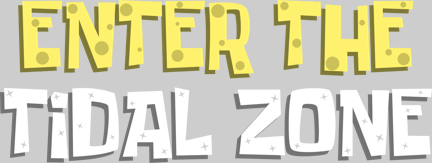

  
  <h1 align="center">Enter the Tidal Zone</h1>
  <h2 align="center">A collaborative effort</h2>
  

    

  
  

  

    
    
    
  

  

    
  

## Workflow
* The [Test](https://github.com/Tidal-Members/EnterTheTidalZone/actions?query=workflow%3ATest) workflow will test the game within Unity to check for errors.
  * Test results can be found as artifacts.
* The [WebGL](https://github.com/Tidal-Members/EnterTheTidalZone/actions?query=workflow%3AWebGL) workflow will build the game and upload the build to [itch.io](https://thetidalzone.itch.io/enterthetidalzone).
  * This build can be played in your browser without downloading.
  * The WebGL build can be found as an artifact.
* The [Android](https://github.com/Tidal-Members/EnterTheTidalZone/actions?query=workflow%3AAndroid) workflow will build the game and upload the build to [itch.io](https://thetidalzone.itch.io/enterthetidalzone).
  * This build is made as most Android devices do not support WebGL.
  * The Android build can be found as an artifact.

## Credits
See [CREDITS.md](CREDITS.md) and [ATTRIBUTED.md](ATTRIBUTED.md).